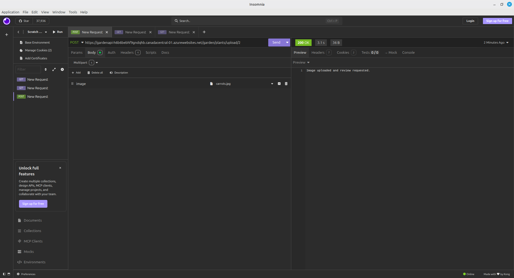
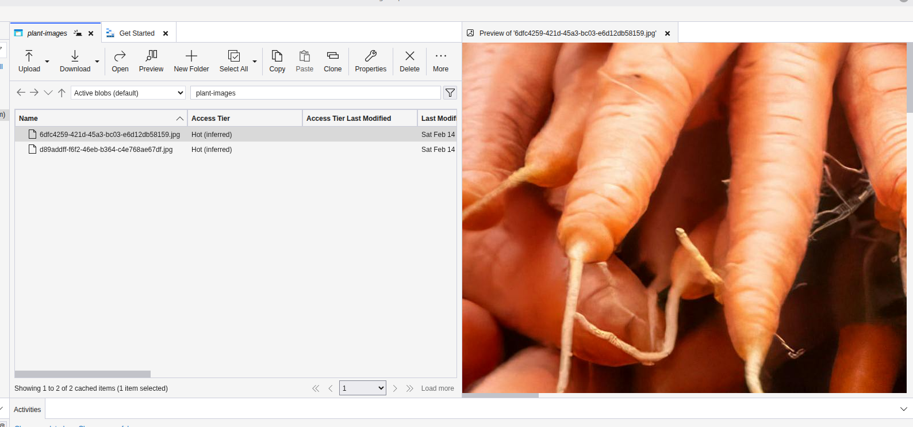

# Garden API

Simple .NET Web API for garden plants.

## Live Demo
Test the API here:  
https://gardenapi-h6b6bebhf9gndqhb.canadacentral-01.azurewebsites.net/garden/plants<br>
https://gardenapi-h6b6bebhf9gndqhb.canadacentral-01.azurewebsites.net/garden/plants/details<br><br>
Uploading images<br>

Testing locally:
https://localhost:7294/garden/plants/upload/1<br><br>

<br>
<br>

Testing live endpoint:
https://gardenapi-h6b6bebhf9gndqhb.canadacentral-01.azurewebsites.net/garden/plants/upload/2

<br>
<br>


OpenAPI JSON<br>
https://gardenapi-h6b6bebhf9gndqhb.canadacentral-01.azurewebsites.net/openapi/v1.json

Returns JSON like:
```json
[{"name":"Eggplant","startMonth":4,"endMonth":5}, ...]
